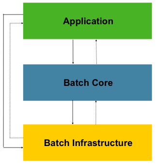

# Spring_Batch_6

## Nouveautés de Spring Boot Batch 6

Documentation issue de [spring-batch-architecture.html](https://docs.spring.io/spring-batch/reference/spring-batch-architecture.html)

[Guide de migration](https://github.com/spring-projects/spring-batch/wiki/Spring-Batch-6.0-Migration-Guide)

### Améliorations de la configuration de l'infrastructure de traitement par lots

À partir de la version 6, vous pouvez configurer les attributs communs pour l'infrastructure de traitement par lots avec `@EnableBatchProcessing`, tandis que les attributs spécifiques au magasin peuvent être spécifiés avec les nouvelles annotations dédiées.

Voici un exemple d'utilisation de ces annotations :

```java
@EnableBatchProcessing(taskExecutorRef = "batchTaskExecutor")
@EnableJdbcJobRepository(dataSourceRef = "batchDataSource", transactionManagerRef = "batchTransactionManager")
class MyJobConfiguration {

    @Bean
    public Job job(JobRepository jobRepository) {
        return new JobBuilder("job", jobRepository)
                    // job flow omitted
                    .build();
    }
}
```

De même, le modèle programmatique basé sur `DefaultBatchConfiguration` a été mis à jour en introduisant deux nouvelles classes de configuration pour définir les attributs spécifiques au magasin : `JdbcDefaultBatchConfiguration` et `MongoDefaultBatchConfiguration`. Ces classes peuvent être utilisées pour configurer par programmation les attributs spécifiques de chaque référentiel de tâches ainsi que d’autres beans d’infrastructure de traitement par lots.

### Infrastructure de traitement par lots sans ressources par défaut

La classe `DefaultBatchConfiguration` a été mise à jour afin de fournir par défaut une infrastructure de traitement par lots « sans ressources » (basée sur l'implémentation de `ResourcelessJobRepository` introduite dans la version 5.2). Cela signifie qu'elle ne nécessite plus de base de données en mémoire (comme H2 ou HSQLDB) pour le référentiel de tâches, qui était auparavant indispensable pour le stockage des métadonnées des traitements par lots.

De plus, cette modification améliorera les performances par défaut des applications par lots lorsque les métadonnées ne sont pas utilisées, car `ResourcelessJobRepository` ne nécessite aucune connexion à une base de données ni aucune transaction.

Enfin, cette modification contribuera à réduire l'empreinte mémoire des applications par lots, car la base de données en mémoire n'est plus nécessaire pour le stockage des métadonnées.

### Simplification de la configuration de l'infrastructure par lots

* L' interface `JobRepository` est désormais étendue `JobExplorer`, il n'est donc plus nécessaire de définir un bean `JobExplorer` séparé.
* L' interface `JobOperator` est désormais étendue `JobLauncher`, il n'est donc plus nécessaire de définir un bean `JobLauncher` séparé.
* Cette fonctionnalité `JobRegistry` est désormais optionnelle et suffisamment intelligente pour enregistrer automatiquement les tâches; il n’est donc plus nécessaire de définir un bean `JobRegistrySmartInitializingSingleton` séparé.
* Le gestionnaire de transactions est désormais facultatif, et un gestionnaire par défaut `ResourcelessTransactionManager` est utilisé si aucun n'est fourni.

Cela réduit le nombre de beans nécessaires pour une application par lots typique et simplifie le code de configuration.

### Nouvelle implémentation du modèle de traitement orienté blocs

La nouvelle implémentation est fournie dans la classe `ChunkOrientedStep`, qui remplace les classes `ChunkOrientedTasklet/ .TaskletStep`

Voici un exemple de définition d'un élément `ChunkOrientedStep` à l'aide de son constructeur :

```java
@Bean
public Step chunkOrientedStep(JobRepository jobRepository, ItemReader<Person> itemReader, ItemWriter<Person> itemWriter) {
    int chunkSize = 100;
    return new ChunkOrientedStepBuilder<Person, Person>("step", jobRepository, chunkSize)
            .reader(itemReader)
            .writer(itemWriter)
            .build();
}
```

De plus, les fonctionnalités de tolérance aux pannes ont été adaptées comme suit :

* La fonctionnalité de nouvelle tentative est désormais basée sur la fonctionnalité de nouvelle tentative introduite dans Spring Framework 7 , au lieu de la bibliothèque Spring Retry précédente.
* La fonction de saut a été légèrement adaptée à la nouvelle implémentation, qui repose désormais entièrement sur l' interface `SkipPolicy`.

Voici un exemple rapide d'utilisation des fonctions de nouvelle tentative et d'ignorance avec la nouvelle version `ChunkOrientedStep` :

```java
@Bean
public Step faultTolerantChunkOrientedStep(JobRepository jobRepository, ItemReader<Person> itemReader, ItemWriter<Person> itemWriter) {

    // retry policy configuration
    int maxRetries = 10;
    var retryableExceptions = Set.of(TransientException.class);
    RetryPolicy retryPolicy = RetryPolicy.builder()
        .maxRetries(maxRetries)
        .includes(retryableExceptions)
        .build();

    // skip policy configuration
    int skipLimit = 50;
    var skippableExceptions = Set.of(FlatFileParseException.class);
    SkipPolicy skipPolicy = new LimitCheckingExceptionHierarchySkipPolicy(skippableExceptions, skipLimit);

    // step configuration
    int chunkSize = 100;
    return new ChunkOrientedStepBuilder<Person, Person>("step", jobRepository, chunkSize)
        .reader(itemReader)
        .writer(itemWriter)
        .faultTolerant()
        .retryPolicy(retryPolicy)
        .skipPolicy(skipPolicy)
        .build();
}
```

### Nouvel opérateur de ligne de commande

Une version moderne de `CommandLineJobRunner`, nommée `CommandLineJobOperator`, qui vous permet d'exécuter des tâches par lots à partir de la ligne de commande (démarrage, arrêt, redémarrage, etc.) et qui est personnalisable, extensible et mise à jour selon les nouvelles modifications introduites dans Spring Batch 6.

### Capacité à récupérer les exécutions de tâches ayant échoué

Cette version introduit une nouvelle méthode `recover` dans `JobOperatorinterface` qui permet de récupérer de manière cohérente les exécutions de tâches ayant échoué dans tous les référentiels de tâches.

### Capacité à arrêter toutes sortes d'étapes

Cette version ajoute une nouvelle interface, nommée `StoppableStep`, qui étend `Step` et qui peut être implémentée par n'importe quelle étape capable de gérer les signaux d'arrêt.

### Assistance à l'arrêt progressif

Lorsqu'un arrêt propre est initié, l'exécution de la tâche interrompt les étapes en cours et met à jour le référentiel de tâches avec un état cohérent permettant sa reprise. Une fois les étapes terminées, l'exécution de la tâche est marquée comme arrêtée et les opérations de nettoyage nécessaires sont effectuées.

### Observabilité avec l'enregistreur Java Flight Recorder (JFR)

En plus des métriques Micrometer existantes, Spring Batch 6.0 introduit la prise en charge du Java Flight Recorder (JFR) pour fournir des capacités d'observabilité améliorées.

JFR est un puissant framework de profilage et de collecte d'événements intégré à la machine virtuelle Java (JVM). Il permet de capturer des informations détaillées sur le comportement d'exécution de vos applications avec un impact minimal sur les performances.

Cette version introduit plusieurs événements JFR pour surveiller les aspects clés de l'exécution d'un travail par lots, notamment l'exécution des tâches et des étapes, les lectures et écritures d'éléments, ainsi que les limites des transactions.

### Annotations de sécurité nulle avec JSpecify

Les API de Spring Batch 6.0 sont désormais annotées avec des annotations [JSpecify](https://jspecify.dev/) afin de fournir de meilleures garanties de sécurité en cas de valeurs nulles et d'améliorer la qualité du code.

### Prise en charge du découpage local

Similaire au découpage distant, le découpage local est une nouvelle fonctionnalité permettant de traiter des lots d'éléments en parallèle, localement au sein de la même JVM et à l'aide de plusieurs threads. Ceci est particulièrement utile pour traiter un grand nombre d'éléments et tirer parti des processeurs multicœurs. Avec le découpage local, vous pouvez configurer une étape orientée blocs pour utiliser plusieurs threads afin de traiter simultanément des lots d'éléments. Chaque thread lit, traite et écrit son propre bloc d'éléments indépendamment, tandis que l'étape gère l'exécution globale et valide les résultats.

### Style SEDA avec canaux de messagerie Spring Integration

Dans Spring Batch 5.2, nous avons introduit le concept de traitement de type SEDA (Staged Event-Driven Architecture) utilisant des threads locaux avec les composants `BlockingQueueItemReader` et `BlockingQueueItemWriter`. S'appuyant sur cette base, Spring Batch 6.0 introduit la prise en charge du traitement de type SEDA à grande échelle grâce aux canaux de messagerie de Spring Integration. Ceci permet de découpler les différentes étapes d'un traitement par lots et de les traiter de manière asynchrone via ces canaux. En tirant parti de Spring Integration, vous pouvez facilement configurer et gérer ces canaux, et bénéficier de fonctionnalités telles que la transformation, le filtrage et le routage des messages.

### Jackson 3 support

Spring Batch 6.0 a été mis à jour pour prendre en charge Jackson 3.x pour le traitement JSON. Cette mise à jour garantit la compatibilité avec les dernières fonctionnalités et améliorations de la bibliothèque Jackson, tout en offrant de meilleures performances et une sécurité renforcée. Tous les composants JSON de Spring Batch, tels que les modules `JSON.Request` `JsonItemReader` et `JSON.Request` `JsonFileItemWriter`, ainsi que le module `JacksonExecutionContextStringSerializer``JSON.Request`, ont été mis à jour pour utiliser Jackson 3.x par défaut.

⚠️**La prise en charge de Jackson 2.x est obsolète et sera supprimée dans une prochaine version. Si vous utilisez actuellement Jackson 2.x dans vos applications Spring Batch, il est recommandé de passer à Jackson 3.x pour bénéficier des dernières fonctionnalités et améliorations.**⚠️

### Assistance à distance

Cette version introduit la prise en charge de l'exécution d'étapes à distance, permettant d'exécuter des étapes d'un traitement par lots sur des machines ou des clusters distants. Cette fonctionnalité est particulièrement utile pour les scénarios de traitement par lots à grande échelle où la répartition de la charge de travail sur plusieurs nœuds permet d'améliorer les performances et l'évolutivité. L'exécution d'étapes à distance est facilitée par l'utilisation des canaux de messagerie Spring Integration, qui assurent la communication entre l'environnement d'exécution local et les exécutants d'étapes distants.

### Configuration de style Lambda

Cette version introduit l'utilisation d'expressions lambda contextuelles pour configurer les artefacts de traitement par lots. Ce nouveau style de configuration offre une manière plus concise et lisible de définir les lecteurs et les rédacteurs d'éléments.

Par exemple, au lieu d'utiliser le modèle de constructeur traditionnel comme ceci :

```java
var reader = new FlatFileItemReaderBuilder()
 .resource(...)
 .delimited()
 .delimiter(",")
 .quoteCharacter('"')
 ...
 .build();
 ```

Vous pouvez désormais utiliser une expression lambda pour configurer les options délimitées comme ceci :

```java
var reader = new FlatFileItemReaderBuilder()
 .resource(...)
 .delimited (config -> config.delimiter(',').quoteCharcter( '"' ))
 ...
 .build();
```

## Architecture de traitement par lots Spring



Cette architecture en couches met en évidence trois composants principaux de haut niveau :
l’application, le noyau et l’infrastructure.

* L’application contient tous les traitements par lots et le code personnalisé écrit par les développeurs à l’aide de Spring Batch.
* Le noyau Batch contient les classes d’exécution essentielles au lancement et au contrôle d’un traitement par lots. Il inclut les implémentations de `read` JobOperator, Job`write` et `Stepretry`.
* L’application et le noyau reposent sur une infrastructure commune. Cette infrastructure comprend des lecteurs et des écrivains communs, ainsi que des services (comme `retry` ) RetryTemplate, utilisés à la fois par les développeurs de l’application (lecteurs et écrivains, tels que `read` et `write` ) et par le framework lui-même (`retry`, qui est sa propre bibliothèque).ItemReaderItemWriter.

## Le langage de domaine du traitement par lots

[Le langage de domaine du traitement par lots](https://docs.spring.io/spring-batch/reference/domain.html)

Propriétés d'exécution des tâches (**Job**)

| Propriété | Définition |
| :--- | :--- |
| **Status** | Un `BatchStatus` objet indiquant l'état de l'exécution. Pendant l'exécution, il est égal à `BatchStatus#STARTED`. En cas d'échec, il est égal à `BatchStatus#FAILED`. Si l'exécution réussit, il est égal à `BatchStatus#COMPLETED`. |
| **startTime** | A `java.time.LocalDateTime` représente l'heure système actuelle au moment du démarrage de l'exécution. Ce champ est vide si la tâche n'a pas encore démarré. |
| **endTime** | A `java.time.LocalDateTime` représente l'heure système actuelle à la fin de l'exécution, qu'elle ait réussi ou non. Ce champ est vide si la tâche n'est pas encore terminée. |
| **exitStatus** | Le `ExitStatus` champ indique le résultat de l'exécution. Il est primordial car il contient un code de sortie renvoyé à l'appelant. Voir le chapitre 5 pour plus de détails. Ce champ est vide si la tâche n'est pas encore terminée. |
| **createTime** | A `java.time.LocalDateTime` représente l'heure système actuelle au moment de la `JobExecution` première persistance. La tâche peut ne pas avoir encore démarré (et n'a donc pas d'heure de début), mais elle possède toujours une date de début `createTime`, requise par le framework pour la gestion des tâches `ExecutionContexts`. |
| **lastUpdated** | A `java.time.LocalDateTime` représente la dernière date et heure `JobExecution` de persistance. Ce champ est vide si la tâche n'a pas encore commencé. |
| **executionContext** | Le « sac de propriétés » contenant toutes les données utilisateur qui doivent être conservées entre les exécutions. |
| **failureExceptions** | La liste des exceptions rencontrées lors de l'exécution d'une fonction `Job`. Celle-ci peut s'avérer utile si plusieurs exceptions surviennent lors de l'échec d'une fonction `Job`. |

Propriétés d'exécution des étapes (**Step**)

| Propriété | Définition |
| :--- | :--- |
| **Status** | Un `BatchStatus` objet indiquant l'état de l'exécution. Pendant l'exécution, l'état est `BatchStatus.STARTED`. En cas d'échec, l'état est `BatchStatus.FAILED`. Si l'exécution réussit, l'état est `BatchStatus.COMPLETED`. |
| **startTime** | A `java.time.LocalDateTime` représente l'heure système actuelle au moment où l'exécution a commencé. Ce champ est vide si l'étape n'a pas encore commencé. |
| **endTime** | A `java.time.LocalDateTime` représente l'heure système actuelle à la fin de l'exécution, qu'elle ait réussi ou non. Ce champ est vide si l'étape n'est pas encore terminée. |
| **exitStatus** | Ce champ `ExitStatus` indique le résultat de l'exécution. Il est primordial car il contient un code de sortie renvoyé à l'appelant. Voir le chapitre 5 pour plus de détails. Ce champ est vide si la tâche n'est pas encore terminée. |
| **executionContext** | Le « sac de propriétés » contenant toutes les données utilisateur qui doivent être conservées entre les exécutions. |
| **readCount** | Le nombre d'éléments qui ont été lus avec succès. |
| **writeCount** | Le nombre d'éléments qui ont été écrits avec succès. |
| **commitCount** | Le nombre de transactions validées pour cette exécution. |
| **rollbackCount** | Le nombre de fois où la transaction commerciale contrôlée par le système `Step` a été annulée. |
| **readSkipCount** | Le nombre de tentatives `read` ayant échoué, ce qui a entraîné l'omission d'un élément. |
| **processSkipCount** | Le nombre de tentatives `process` ayant échoué, ce qui a entraîné l'omission d'un élément. |
| **filterCount** | Le nombre d'éléments qui ont été « filtrés » par le `ItemProcessor`. |
| **writeSkipCount** | Le nombre de tentatives `write` ayant échoué, ce qui a entraîné l'omission d'un élément. |

## Travaux Dirigés

Vous allez créer un service qui importe des données à partir d'une feuille de calcul CSV, les transforme à l'aide de code personnalisé et stocke les résultats finaux dans une base de données.

### Initialisation du projet

* Initialiser votre projet à l'aide de Spring Initializr, et y ajouter les dependences `Spring Batch` et `HyperSQL Database`. Nous utiliserons maven et java 25 pour le projet.
* En général, votre client ou un analyste métier fournit une feuille de calcul. Dans cet exemple simple, vous trouverez des données fictives dans [input](src/main/resources/sample-data.csv).
* Ensuite, vous devez écrire un script SQL pour créer une table destinée à stocker les données. Vous trouverez un tel script ici [schema](src/main/resources/schema-all.sql). `Remarques` : Spring Boot exécute schema-@@platform@@.sql automatiquement au démarrage. `-all` C'est le comportement par défaut pour toutes les plateformes.

### Création d'un enregistrement (Record) d'une personne

Voir fichier [Record Person](src/main/java/ruffinjy/spring_batch_demo/domain/Person.java).
Vous pouvez instancier le record d'une Person avec le prénom et le nom via le constructeur.

### Création d'un processus intermédiaire

En traitement par lots, il est courant d'ingérer des données, de les transformer, puis de les acheminer vers une autre destination. Ici, vous devez écrire un transformateur simple qui convertit les noms en majuscules.

Voir fichier [Transforme datas](src/main/java/ruffinjy/spring_batch_demo/batch_processor/PersonItemProcessor.java).

`PersonItemProcessor` implémente l'interface de Spring Batch `ItemProcessor`. Cela facilite l'intégration du code dans un traitement par lots. Conformément à l'interface, vous recevez un objet entrant `Person`, que vous transformez ensuite en un objet en majuscules Person.

### Assemblage du job Batch

Il vous faut maintenant mettre en place le traitement par lots. Spring Batch fournit de nombreuses classes utilitaires qui réduisent le besoin d'écrire du code personnalisé. Vous pouvez ainsi vous concentrer sur la logique métier.

Pour configurer votre tâche, vous devez d'abord créer une classe `@Configuration` Spring comme dans l'exemple suivant [Configuration](src/main/java/ruffinjy/spring_batch_demo/configurations/BatchConfiguration.java). Cet exemple utilise une base de données en mémoire, ce qui signifie qu'une fois la tâche terminée, les données sont effacées. Ajoutez ensuite les beans suivants à votre classe `BatchConfiguration` pour définir les `@Bean` `reader`, `processor`, et un `writer`.

Le premier bloc de code définit l'entrée, le processeur et la sortie.

* `reader()` crée un `ItemReader`. Il recherche un fichier appelé _sample-data.csv_ et analyse chaque élément de ligne avec suffisamment d'informations pour le transformer en un objet `Person`.
* `processor()` crée une instance de la fonction `PersonItemProcessor` que vous avez définie précédemment, destinée à convertir les données en majuscules.
* `writer(DataSource)` crée un objet `ItemWriter`. Celui-ci est destiné au JDBC et obtient automatiquement un objet `DataSource` créé par Spring Boot. Il inclut l'instruction SQL nécessaire à l'insertion d'un seul enregistrement Person, piloté par des composants d'enregistrement Java.

Les blocs suivants définie le `Job` (la tâche) et les `Step` (les étapes).

* Les tâches sont composées `Step`, chacune pouvant impliquer un `reader`, un `processor`, et un `writer`.
* Vous listez ensuite chaque `Step` (bien que cette tâche ne comporte qu'un seul step). La tâche se termine et l'API Java génère un `Step` parfaitement configurée.
* Dans la définition d'un step, vous spécifiez la quantité de données à écrire simultanément. Ici, jusqu'à `3` enregistrements sont écrits à la fois. Ensuite, vous configurez le reader, processor, et writer à l'aide des beans injectés précédemment.
* La dernière partie de la configuration par lots permet d'être notifié de la fin de l'exécution [notification](src/main/java/ruffinjy/spring_batch_demo/notifications/JobCompletionNotificationListener.java). Le `JobCompletionNotificationListener` écoute lorsqu'une tâche est lancée `BatchStatus.COMPLETED`, puis utilise `JdbcTemplate` pour inspecter les résultats.

### Execution de l'application

`@SpringBootApplication` est une annotation de commodité qui ajoute tout ce qui suit :

* `@Configuration`: Indique que la classe est une source de définitions de beans pour le contexte de l'application.
* `@EnableAutoConfiguration`: Indique à Spring Boot de commencer à ajouter des beans en fonction des paramètres du classpath, des autres beans et de divers paramètres de propriétés. Par exemple, si le fichier spring-webmvc est présent dans le classpath, cette annotation signale l'application comme une application web et active des comportements clés, tels que la configuration d'un DispatcherServlet.
* `@ComponentScan`: Indique à Spring de rechercher d'autres composants, configurations et services dans le com/example package, lui permettant ainsi de trouver les contrôleurs.

Cette méthode `main()` utilise Spring Boot SpringApplication.run() pour lancer une application. Avez-vous remarqué l'absence totale de code XML ? Aucun web.xml fichier n'est présent non plus. Cette application web est entièrement écrite en Java et vous n'avez eu à vous soucier d'aucune configuration d'infrastructure.

Veuillez noter System.exit() sur SpringApplication.exit() que la JVM doit s'arrêter une fois la tâche terminée. Consultez la section « Arrêt de l'application » de la documentation de référence de Spring Boot pour plus de détails.

À titre de démonstration, un code permet d'injecter un élément JdbcTemplate, d'interroger la base de données et d'afficher les noms des personnes insérées par le traitement par lots.

_Notez que l'application n'utilise pas l'annotation `@EnableBatchProcessing`. Auparavant, `@EnableBatchProcessing` permettait d'activer la configuration automatique de Spring Batch par Spring Boot. Désormais, un bean annoté avec `@EnableBatchProcessing` ou étendant `DefaultBatchConfiguration` peut être défini pour désactiver la configuration automatique, laissant ainsi à l'application le contrôle total de la configuration de Spring Batch._
