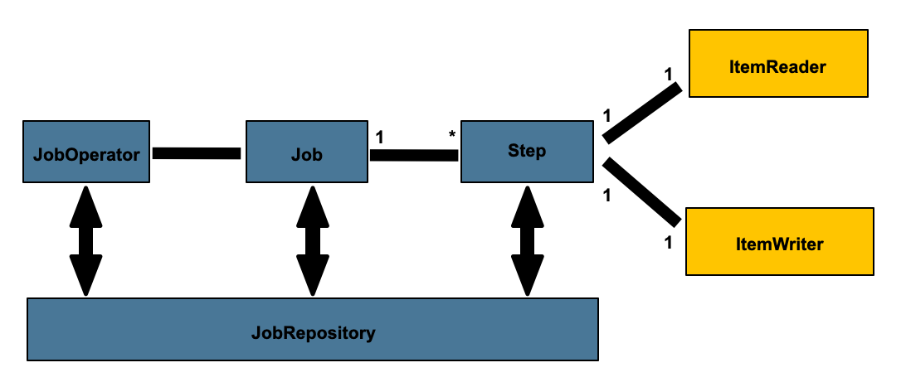
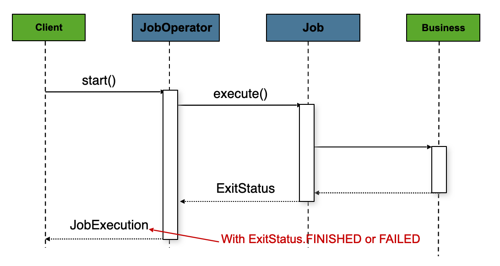
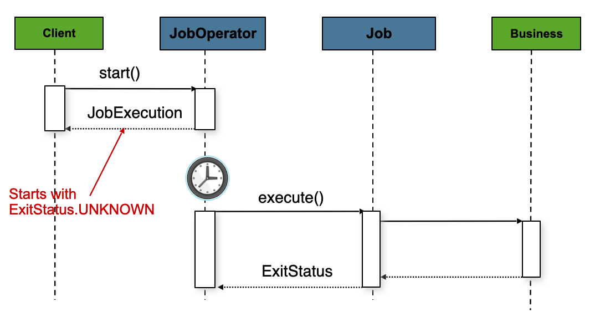
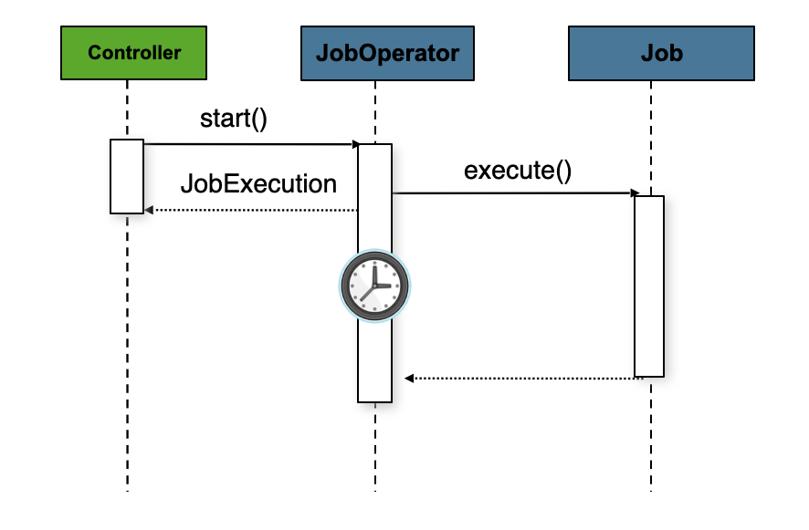

# Spring_Batch_6

## Nouveautés de Spring Boot Batch 6

Documentation issue de [spring-batch-architecture.html](https://docs.spring.io/spring-batch/reference/spring-batch-architecture.html)

[Guide de migration](https://github.com/spring-projects/spring-batch/wiki/Spring-Batch-6.0-Migration-Guide)

### Améliorations de la configuration de l'infrastructure de traitement par lots

À partir de la version 6, vous pouvez configurer les attributs communs pour l'infrastructure de traitement par lots avec `@EnableBatchProcessing`, tandis que les attributs spécifiques au magasin peuvent être spécifiés avec les nouvelles annotations dédiées.

Voici un exemple d'utilisation de ces annotations :

```java
@EnableBatchProcessing(taskExecutorRef = "batchTaskExecutor")
@EnableJdbcJobRepository(dataSourceRef = "batchDataSource", transactionManagerRef = "batchTransactionManager")
class MyJobConfiguration {

    @Bean
    public Job job(JobRepository jobRepository) {
        return new JobBuilder("job", jobRepository)
                    // job flow omitted
                    .build();
    }
}
```

De même, le modèle programmatique basé sur `DefaultBatchConfiguration` a été mis à jour en introduisant deux nouvelles classes de configuration pour définir les attributs spécifiques au magasin : `JdbcDefaultBatchConfiguration` et `MongoDefaultBatchConfiguration`. Ces classes peuvent être utilisées pour configurer par programmation les attributs spécifiques de chaque référentiel de tâches ainsi que d’autres beans d’infrastructure de traitement par lots.

### Infrastructure de traitement par lots sans ressources par défaut

La classe `DefaultBatchConfiguration` a été mise à jour afin de fournir par défaut une infrastructure de traitement par lots « sans ressources » (basée sur l'implémentation de `ResourcelessJobRepository` introduite dans la version 5.2). Cela signifie qu'elle ne nécessite plus de base de données en mémoire (comme H2 ou HSQLDB) pour le référentiel de tâches, qui était auparavant indispensable pour le stockage des métadonnées des traitements par lots.

De plus, cette modification améliorera les performances par défaut des applications par lots lorsque les métadonnées ne sont pas utilisées, car `ResourcelessJobRepository` ne nécessite aucune connexion à une base de données ni aucune transaction.

Enfin, cette modification contribuera à réduire l'empreinte mémoire des applications par lots, car la base de données en mémoire n'est plus nécessaire pour le stockage des métadonnées.

### Simplification de la configuration de l'infrastructure par lots

* L' interface `JobRepository` est désormais étendue `JobExplorer`, il n'est donc plus nécessaire de définir un bean `JobExplorer` séparé.
* L' interface `JobOperator` est désormais étendue `JobLauncher`, il n'est donc plus nécessaire de définir un bean `JobLauncher` séparé.
* Cette fonctionnalité `JobRegistry` est désormais optionnelle et suffisamment intelligente pour enregistrer automatiquement les tâches; il n’est donc plus nécessaire de définir un bean `JobRegistrySmartInitializingSingleton` séparé.
* Le gestionnaire de transactions est désormais facultatif, et un gestionnaire par défaut `ResourcelessTransactionManager` est utilisé si aucun n'est fourni.

Cela réduit le nombre de beans nécessaires pour une application par lots typique et simplifie le code de configuration.

### Nouvelle implémentation du modèle de traitement orienté blocs

La nouvelle implémentation est fournie dans la classe `ChunkOrientedStep`, qui remplace les classes `ChunkOrientedTasklet/ .TaskletStep`

Voici un exemple de définition d'un élément `ChunkOrientedStep` à l'aide de son constructeur :

```java
@Bean
public Step chunkOrientedStep(JobRepository jobRepository, ItemReader<Person> itemReader, ItemWriter<Person> itemWriter) {
    int chunkSize = 100;
    return new ChunkOrientedStepBuilder<Person, Person>("step", jobRepository, chunkSize)
            .reader(itemReader)
            .writer(itemWriter)
            .build();
}
```

De plus, les fonctionnalités de tolérance aux pannes ont été adaptées comme suit :

* La fonctionnalité de nouvelle tentative est désormais basée sur la fonctionnalité de nouvelle tentative introduite dans Spring Framework 7 , au lieu de la bibliothèque Spring Retry précédente.
* La fonction de saut a été légèrement adaptée à la nouvelle implémentation, qui repose désormais entièrement sur l' interface `SkipPolicy`.

Voici un exemple rapide d'utilisation des fonctions de nouvelle tentative et d'ignorance avec la nouvelle version `ChunkOrientedStep` :

```java
@Bean
public Step faultTolerantChunkOrientedStep(JobRepository jobRepository, ItemReader<Person> itemReader, ItemWriter<Person> itemWriter) {

    // retry policy configuration
    int maxRetries = 10;
    var retryableExceptions = Set.of(TransientException.class);
    RetryPolicy retryPolicy = RetryPolicy.builder()
        .maxRetries(maxRetries)
        .includes(retryableExceptions)
        .build();

    // skip policy configuration
    int skipLimit = 50;
    var skippableExceptions = Set.of(FlatFileParseException.class);
    SkipPolicy skipPolicy = new LimitCheckingExceptionHierarchySkipPolicy(skippableExceptions, skipLimit);

    // step configuration
    int chunkSize = 100;
    return new ChunkOrientedStepBuilder<Person, Person>("step", jobRepository, chunkSize)
        .reader(itemReader)
        .writer(itemWriter)
        .faultTolerant()
        .retryPolicy(retryPolicy)
        .skipPolicy(skipPolicy)
        .build();
}
```

### Nouvel opérateur de ligne de commande

Une version moderne de `CommandLineJobRunner`, nommée `CommandLineJobOperator`, qui vous permet d'exécuter des tâches par lots à partir de la ligne de commande (démarrage, arrêt, redémarrage, etc.) et qui est personnalisable, extensible et mise à jour selon les nouvelles modifications introduites dans Spring Batch 6.

### Capacité à récupérer les exécutions de tâches ayant échoué

Cette version introduit une nouvelle méthode `recover` dans `JobOperatorinterface` qui permet de récupérer de manière cohérente les exécutions de tâches ayant échoué dans tous les référentiels de tâches.

### Capacité à arrêter toutes sortes d'étapes

Cette version ajoute une nouvelle interface, nommée `StoppableStep`, qui étend `Step` et qui peut être implémentée par n'importe quelle étape capable de gérer les signaux d'arrêt.

### Assistance à l'arrêt progressif

Lorsqu'un arrêt propre est initié, l'exécution du job interrompt les étapes en cours et met à jour le référentiel de tâches avec un état cohérent permettant sa reprise. Une fois les étapes terminées, l'exécution du job est marquée comme arrêtée et les opérations de nettoyage nécessaires sont effectuées.

### Observabilité avec l'enregistreur Java Flight Recorder (JFR)

En plus des métriques Micrometer existantes, Spring Batch 6.0 introduit la prise en charge du Java Flight Recorder (JFR) pour fournir des capacités d'observabilité améliorées.

JFR est un puissant framework de profilage et de collecte d'événements intégré à la machine virtuelle Java (JVM). Il permet de capturer des informations détaillées sur le comportement d'exécution de vos applications avec un impact minimal sur les performances.

Cette version introduit plusieurs événements JFR pour surveiller les aspects clés de l'exécution d'un travail par lots, notamment l'exécution des tâches et des étapes, les lectures et écritures d'éléments, ainsi que les limites des transactions.

### Annotations de sécurité nulle avec JSpecify

Les API de Spring Batch 6.0 sont désormais annotées avec des annotations [JSpecify](https://jspecify.dev/) afin de fournir de meilleures garanties de sécurité en cas de valeurs nulles et d'améliorer la qualité du code.

### Prise en charge du découpage local

Similaire au découpage distant, le découpage local est une nouvelle fonctionnalité permettant de traiter des lots d'éléments en parallèle, localement au sein de la même JVM et à l'aide de plusieurs threads. Ceci est particulièrement utile pour traiter un grand nombre d'éléments et tirer parti des processeurs multicœurs. Avec le découpage local, vous pouvez configurer une étape orientée blocs pour utiliser plusieurs threads afin de traiter simultanément des lots d'éléments. Chaque thread lit, traite et écrit son propre bloc d'éléments indépendamment, tandis que l'étape gère l'exécution globale et valide les résultats.

### Style SEDA avec canaux de messagerie Spring Integration

Dans Spring Batch 5.2, nous avons introduit le concept de traitement de type SEDA (Staged Event-Driven Architecture) utilisant des threads locaux avec les composants `BlockingQueueItemReader` et `BlockingQueueItemWriter`. S'appuyant sur cette base, Spring Batch 6.0 introduit la prise en charge du traitement de type SEDA à grande échelle grâce aux canaux de messagerie de Spring Integration. Ceci permet de découpler les différentes étapes d'un traitement par lots et de les traiter de manière asynchrone via ces canaux. En tirant parti de Spring Integration, vous pouvez facilement configurer et gérer ces canaux, et bénéficier de fonctionnalités telles que la transformation, le filtrage et le routage des messages.

### Jackson 3 support

Spring Batch 6.0 a été mis à jour pour prendre en charge Jackson 3.x pour le traitement JSON. Cette mise à jour garantit la compatibilité avec les dernières fonctionnalités et améliorations de la bibliothèque Jackson, tout en offrant de meilleures performances et une sécurité renforcée. Tous les composants JSON de Spring Batch, tels que les modules `JSON.Request` `JsonItemReader` et `JSON.Request` `JsonFileItemWriter`, ainsi que le module `JacksonExecutionContextStringSerializer``JSON.Request`, ont été mis à jour pour utiliser Jackson 3.x par défaut.

⚠️**La prise en charge de Jackson 2.x est obsolète et sera supprimée dans une prochaine version. Si vous utilisez actuellement Jackson 2.x dans vos applications Spring Batch, il est recommandé de passer à Jackson 3.x pour bénéficier des dernières fonctionnalités et améliorations.**⚠️

### Assistance à distance

Cette version introduit la prise en charge de l'exécution d'étapes à distance, permettant d'exécuter des étapes d'un traitement par lots sur des machines ou des clusters distants. Cette fonctionnalité est particulièrement utile pour les scénarios de traitement par lots à grande échelle où la répartition de la charge de travail sur plusieurs nœuds permet d'améliorer les performances et l'évolutivité. L'exécution d'étapes à distance est facilitée par l'utilisation des canaux de messagerie Spring Integration, qui assurent la communication entre l'environnement d'exécution local et les exécutants d'étapes distants.

### Configuration de style Lambda

Cette version introduit l'utilisation d'expressions lambda contextuelles pour configurer les artefacts de traitement par lots. Ce nouveau style de configuration offre une manière plus concise et lisible de définir les lecteurs et les rédacteurs d'éléments.

Par exemple, au lieu d'utiliser le modèle de constructeur traditionnel comme ceci :

```java
var reader = new FlatFileItemReaderBuilder()
 .resource(...)
 .delimited()
 .delimiter(",")
 .quoteCharacter('"')
 ...
 .build();
 ```

Vous pouvez désormais utiliser une expression lambda pour configurer les options délimitées comme ceci :

```java
var reader = new FlatFileItemReaderBuilder()
 .resource(...)
 .delimited (config -> config.delimiter(',').quoteCharcter( '"' ))
 ...
 .build();
```

## Architecture de traitement par lots Spring


Cette architecture en couches met en évidence trois composants principaux de haut niveau :
l’application, le noyau et l’infrastructure.

* L’application contient tous les traitements par lots et le code personnalisé écrit par les développeurs à l’aide de Spring Batch.
* Le noyau Batch contient les classes d’exécution essentielles au lancement et au contrôle d’un traitement par lots. Il inclut les implémentations de `read` JobOperator, Job`write` et `Stepretry`.
* L’application et le noyau reposent sur une infrastructure commune. Cette infrastructure comprend des lecteurs et des écrivains communs, ainsi que des services (comme `retry` ) RetryTemplate, utilisés à la fois par les développeurs de l’application (lecteurs et écrivains, tels que `read` et `write` ) et par le framework lui-même (`retry`, qui est sa propre bibliothèque).ItemReaderItemWriter.

## Le langage de domaine du traitement par lots

[Le langage de domaine du traitement par lots](https://docs.spring.io/spring-batch/reference/domain.html)

Propriétés d'exécution des **Job**

| Propriété | Définition |
| :--- | :--- |
| **Status** | Un `BatchStatus` objet indiquant l'état de l'exécution. Pendant l'exécution, il est égal à `BatchStatus#STARTED`. En cas d'échec, il est égal à `BatchStatus#FAILED`. Si l'exécution réussit, il est égal à `BatchStatus#COMPLETED`. |
| **startTime** | A `java.time.LocalDateTime` représente l'heure système actuelle au moment du démarrage de l'exécution. Ce champ est vide si le job n'a pas encore démarré. |
| **endTime** | A `java.time.LocalDateTime` représente l'heure système actuelle à la fin de l'exécution, qu'elle ait réussi ou non. Ce champ est vide si le job n'est pas encore terminée. |
| **exitStatus** | Le `ExitStatus` champ indique le résultat de l'exécution. Il est primordial car il contient un code de sortie renvoyé à l'appelant. Voir le chapitre 5 pour plus de détails. Ce champ est vide si le job n'est pas encore terminée. |
| **createTime** | A `java.time.LocalDateTime` représente l'heure système actuelle au moment de la `JobExecution` première persistance. Le job peut ne pas avoir encore démarré (et n'a donc pas d'heure de début), mais elle possède toujours une date de début `createTime`, requise par le framework pour la gestion des tâches `ExecutionContexts`. |
| **lastUpdated** | A `java.time.LocalDateTime` représente la dernière date et heure `JobExecution` de persistance. Ce champ est vide si le job n'a pas encore commencé. |
| **executionContext** | Le « sac de propriétés » contenant toutes les données utilisateur qui doivent être conservées entre les exécutions. |
| **failureExceptions** | La liste des exceptions rencontrées lors de l'exécution d'une fonction `Job`. Celle-ci peut s'avérer utile si plusieurs exceptions surviennent lors de l'échec d'une fonction `Job`. |

Propriétés d'exécution des **Step**

| Propriété | Définition |
| :--- | :--- |
| **Status** | Un `BatchStatus` objet indiquant l'état de l'exécution. Pendant l'exécution, l'état est `BatchStatus.STARTED`. En cas d'échec, l'état est `BatchStatus.FAILED`. Si l'exécution réussit, l'état est `BatchStatus.COMPLETED`. |
| **startTime** | A `java.time.LocalDateTime` représente l'heure système actuelle au moment où l'exécution a commencé. Ce champ est vide si l'étape n'a pas encore commencé. |
| **endTime** | A `java.time.LocalDateTime` représente l'heure système actuelle à la fin de l'exécution, qu'elle ait réussi ou non. Ce champ est vide si l'étape n'est pas encore terminée. |
| **exitStatus** | Ce champ `ExitStatus` indique le résultat de l'exécution. Il est primordial car il contient un code de sortie renvoyé à l'appelant. Voir le chapitre 5 pour plus de détails. Ce champ est vide si le job n'est pas encore terminée. |
| **executionContext** | Le « sac de propriétés » contenant toutes les données utilisateur qui doivent être conservées entre les exécutions. |
| **readCount** | Le nombre d'éléments qui ont été lus avec succès. |
| **writeCount** | Le nombre d'éléments qui ont été écrits avec succès. |
| **commitCount** | Le nombre de transactions validées pour cette exécution. |
| **rollbackCount** | Le nombre de fois où la transaction commerciale contrôlée par le système `Step` a été annulée. |
| **readSkipCount** | Le nombre de tentatives `read` ayant échoué, ce qui a entraîné l'omission d'un élément. |
| **processSkipCount** | Le nombre de tentatives `process` ayant échoué, ce qui a entraîné l'omission d'un élément. |
| **filterCount** | Le nombre d'éléments qui ont été « filtrés » par le `ItemProcessor`. |
| **writeSkipCount** | Le nombre de tentatives `write` ayant échoué, ce qui a entraîné l'omission d'un élément. |

## Configuration et execution d'un job



Bien que l'objet `Job` puisse sembler être un simple conteneur d'étapes, il est important de connaître les nombreuses options de configuration. De plus, il faut prendre en compte plusieurs options concernant l'exécution d'un objet `Job` et le stockage de ses métadonnées pendant cette exécution. Ce chapitre explique les différentes options de configuration et les aspects liés à l'exécution d'un objet `Job`.

## Configuration de l'infrastructure de traitement par batch

Comme décrit précédemment, Spring Batch s'appuie sur plusieurs beans d'infrastructure pour exécuter les job et les step, notamment les beans `<beans>` **JobOperatoret** `<beans>` **JobRepository**. Bien qu'il soit possible de définir ces beans manuellement, il est beaucoup plus simple d'utiliser l'annotation **@EnableBatchProcessing** `@Infrastructure` ou la classe **DefaultBatchConfiguration** `<beans>` pour fournir une configuration de base.

Par défaut, Spring Batch fournit une configuration d'infrastructure batch sans ressources, basée sur l'implémentation de **ResourcelessJobRepository**. Si vous souhaitez utiliser un dépôt de job avec base de données, vous pouvez utiliser les annotations **@EnableJdbcJobRepository** `@ JobRepository` ou les classes équivalentes.

### Configuration basée sur les annotations

Cette annotation `@EnableBatchProcessing` fonctionne de manière similaire aux autres annotations `@Enable` de la famille Spring. Dans ce cas précis, `@EnableBatchProcessing` fournit une configuration de base pour la création de job par batch. Cette configuration de base crée une instance de chaque classe `StepScope` et `JobScope` qui rend disponibles plusieurs beans pouvant être injectés automatiquement.

* **JobRepository**: un bean nommé `jobRepository`
* **JobOperator**: un bean nommé `jobOperator`

Voici un exemple d'utilisation de l'annotation `@EnableBatchProcessing` dans une classe de configuration Java :

```java
@Configuration
@EnableBatchProcessing
public class MyJobConfiguration {
 @Bean
 public Job job(JobRepository jobRepository) {
  return new JobBuilder("myJob", jobRepository)
    //define job flow as needed
    .build();
 }
}
```

_⚠️Une seule classe de configuration doit être annotée `@EnableBatchProcessing`. Une fois cette annotation ajoutée, vous disposez de toute la configuration décrite précédemment.⚠️_

### Configuration programmatique

À l'instar de la configuration par annotations, une méthode de configuration programmatique des beans d'infrastructure est proposée via cette classe `DefaultBatchConfiguration`. Cette classe fournit les mêmes beans que ceux fournis par la classe `@EnableBatchProcessing` et peut servir de classe de base pour configurer les tâches par lots. L'extrait de code suivant illustre son utilisation :

```java
@Configuration
class MyJobConfiguration extends DefaultBatchConfiguration {

 @Bean
 public Job job(JobRepository jobRepository) {
  return new JobBuilder("myJob", jobRepository)
    // define job flow as needed
    .build();
 }

}
```

_⚠️`@EnableBatchProcessing` ne doit pas être utilisé avec `DefaultBatchConfiguration`. Vous devez soit utiliser la méthode déclarative de configuration de Spring Batch via `@EnableBatchProcessing`, soit utiliser la méthode programmatique d'extension `DefaultBatchConfiguration`, mais pas les deux simultanément.⚠️_

## Configuration d'un job

L'interface possède plusieurs implémentations Job. Celles-ci sont toutefois abstraites derrière les générateurs fournis (pour la configuration Java) ou l'espace de noms XML (pour la configuration XML). L'exemple suivant illustre les configurations Java :

```java
@Bean
public Job footballJob(JobRepository jobRepository) {
    return new JobBuilder("footballJob", jobRepository)
                     .start(playerLoad())
                     .next(gameLoad())
                     .next(playerSummarization())
                     .build();
}
```

Un `Job` (et, généralement, tout les `Step` qu'il contient) nécessite un `JobRepository`.

L'exemple précédent illustre un `Job` qui se compose de trois instances `Step`. Les constructeurs liés aux tâches peuvent également contenir d'autres éléments qui facilitent la parallélisation (`Split`), le contrôle de flux déclaratif (`Decision`) et l'externalisation des définitions de flux (`Flow`).

### Redémarrage possible

Un point crucial lors de l'exécution d'un traitement par batch concerne le comportement d'une instance `Job` lorsqu'elle est redémarrée. Le lancement d'une instance `Job` est considéré comme un « redémarrage » si une instance `JobExecution` existe déjà pour cette instance `JobInstance`. Idéalement, toutes les `Step` devraient pouvoir reprendre là où elles se sont arrêtées, mais il existe des cas où cela n'est pas possible. Dans ce cas, il incombe entièrement au développeur de s'assurer qu'une nouvelle instance `JobInstance` est créée. Cependant, Spring Batch propose une solution. Si une instance `Job` ne doit jamais être redémarrée mais doit toujours être exécutée dans le cadre d'une nouvelle instance `JobInstance`, vous pouvez définir la propriété `restartable` sur `true` `false`.

L'exemple suivant montre comment définir le champ `restartable` à false en Java :

```java
@Bean
public Job footballJob(JobRepository jobRepository) {
    return new JobBuilder("footballJob", jobRepository)
                     .preventRestart()
                     ...
                     .build();
}
```

### Interception de l'exécution des tâches

Au cours de l'exécution d'un Step Job, il peut être utile d'être notifié de divers événements de son cycle de vie afin de pouvoir exécuter du code personnalisé. `SimpleJob` permet cela en appelant une fonction `JobListener` au moment opportun :

```java
public interface JobExecutionListener {

    void beforeJob(JobExecution jobExecution);

    void afterJob(JobExecution jobExecution);
}
```

Vous pouvez ajouter des éléments `JobListeners` au `SimpleJob` en configurant des écouteurs sur la tâche.
L'exemple suivant montre comment ajouter une méthode d'écoute à une définition de tâche Java :

```java
@Bean
public Job footballJob(JobRepository jobRepository) {
    return new JobBuilder("footballJob", jobRepository)
                     .listener(sampleListener())
                     ...
                     .build();
}
```

Notez que la méthode `afterJob` est appelée indépendamment du succès ou de l'échec de l'opération Job. Si vous devez déterminer le succès ou l'échec, vous pouvez obtenir cette information à partir de `JobExecution`:

```java
public void afterJob(JobExecution jobExecution){
    if (jobExecution.getStatus() == BatchStatus.COMPLETED ) {
        //job success
    }
    else if (jobExecution.getStatus() == BatchStatus.FAILED) {
        //job failure
    }
}
```

Les annotations correspondant à cette interface sont :

* `@BeforeJob`
* `@AfterJob`

### Héritage d'un Job parent

Dans l'exemple suivant, `baseJob` est une définition `Job` abstraite qui ne définit qu'une liste d'écouteurs. est une définition concrète `Job` `job1` qui hérite de la liste d'écouteurs de `baseJob` et la fusionne avec sa propre liste d'écouteurs pour produire `Job` avec deux écouteurs et un `Step( step1)`.

```xml
<job id="baseJob" abstract="true">
    <listeners>
        <listener ref="listenerOne"/>
    </listeners>
</job>

<job id="job1" parent="baseJob">
    <step id="step1" parent="standaloneStep"/>

    <listeners merge="true">
        <listener ref="listenerTwo"/>
    </listeners>
</job>
```

### JobParametersValidator (Validateur des paramètres d'un batch)

Un job déclarée dans l'espace de noms XML ou utilisant une sous-classe `AbstractJob` peut, en option, déclarer un validateur pour ses paramètres lors de l'exécution. Ceci est utile, par exemple, pour vérifier qu'une tâche est lancée avec tous ses paramètres obligatoires. Il existe un validateur `DefaultJobParametersValidator` permettant de contraindre les combinaisons de paramètres obligatoires et optionnels simples. Pour des contraintes plus complexes, vous pouvez implémenter vous-même l'interface.

```java
@Bean
public Job job1(JobRepository jobRepository) {
    return new JobBuilder("job1", jobRepository)
                     .validator(parametersValidator())
                     ...
                     .build();
}
```

## JobRepository (Configuration d'un repository de batch)

### Configuration Resourceless JobRepository (sans ressources)

_⚠️Cette implémentation n'est pas sûre pour le multithreading et ne doit pas être utilisée dans un environnement concurrent.⚠️_
Par défaut, lorsque vous utilisez `@EnableBatchProcessing` ou `DefaultBatchConfiguration`, un `ResourcelessJobRepository` est fourni pour vous.

### Configuration d'un JobRepository JDBC

```java
@Configuration
@EnableBatchProcessing
@EnableJdbcJobRepository(
  dataSourceRef = "batchDataSource",
  transactionManagerRef = "batchTransactionManager",
  tablePrefix = "BATCH_",
  maxVarCharLength = 1000,
  isolationLevelForCreate = "SERIALIZABLE")
public class MyJobConfiguration {
   // job definition
}
```

### Configuration des transactions pour le JobRepository

Si l'espace de noms ou l'objet fourni `FactoryBean`est utilisé, des conseils transactionnels sont automatiquement créés autour du dépôt. Ceci afin de garantir la persistance correcte des métadonnées des lots, notamment l'état nécessaire aux redémarrages après une panne. Le comportement du framework est mal défini si les méthodes du dépôt ne sont pas transactionnelles. Le niveau d'isolation dans les attributs `create` de la méthode est spécifié séparément pour garantir que, lors du lancement du batch, si deux processus tentent de lancer la même job simultanément, un seul réussisse. Le niveau d'isolation par défaut pour cette méthode est « transactionnel » `SERIALIZABLE`, ce qui est assez restrictif. Un niveau `READ_COMMITTED` « transactionnel » fonctionne généralement tout aussi bien. `READ_UNCOMMITTED` Un niveau « transactionnel » convient si deux processus sont peu susceptibles d'entrer en collision de cette manière. Cependant, comme un appel à la méthode `create` est assez court, il est peu probable que `SERIALIZED` pose problème, tant que la plateforme de base de données le prend en charge. Vous pouvez toutefois modifier ce paramètre.

```java
@Configuration
@EnableBatchProcessing
@EnableJdbcJobRepository(isolationLevelForCreate = "ISOLATION_REPEATABLE_READ")
public class MyJobConfiguration {
   // job definition
}
```

Si l'espace de noms n'est pas utilisé, vous devez également configurer le comportement transactionnel du référentiel à l'aide de l'AOP.

```java
@Bean
public TransactionProxyFactoryBean baseProxy() {
 TransactionProxyFactoryBean transactionProxyFactoryBean = new TransactionProxyFactoryBean();
 Properties transactionAttributes = new Properties();
 transactionAttributes.setProperty("*", "PROPAGATION_REQUIRED");
 transactionProxyFactoryBean.setTransactionAttributes(transactionAttributes);
 transactionProxyFactoryBean.setTarget(jobRepository());
 transactionProxyFactoryBean.setTransactionManager(transactionManager());
 return transactionProxyFactoryBean;
}
```

### Types de bases de données non standard dans un référentiel

```java
@Bean
public JobRepository jobRepository() throws Exception {
    JdbcJobRepositoryFactoryBean factory = new JdbcJobRepositoryFactoryBean();
    factory.setDataSource(dataSource);
    factory.setDatabaseType("db2");
    factory.setTransactionManager(transactionManager);
    return factory.getObject();
}
```

## Configuring a JobOperator

L'implémentation la plus simple de l'interface `JobOperator` est celle-ci `TaskExecutorJobOperator`. Elle ne requiert qu'une seule dépendance : un opérateur `JobRepository`. Toutes les autres dépendances, telles que `JobRegistry`, `MeterRegistry`, `TransactionManager`, etc., sont optionnelles. Spring Batch fournit un bean de fabrique pour simplifier la configuration de cet opérateur : `JobOperatorFactoryBean`. Ce bean de fabrique crée un proxy transactionnel autour de l'opérateur `TaskExecutorJobOperator` afin de garantir que toutes ses méthodes publiques soient exécutées au sein d'une transaction.

Une fois qu'un `JobExecution` est obtenu, il est transmis à la méthode execute de Job, renvoyant finalement le résultat `JobExecution` à l'appelant, comme le montre l'image suivante :



La séquence est simple et fonctionne correctement lorsqu'elle est lancée depuis un planificateur. Cependant, des problèmes surviennent lors d'un lancement via une requête HTTP. Dans ce cas, le lancement doit être asynchrone afin que la réponse `TaskExecutorJobOperator` soit immédiatement renvoyée à l'appelant. En effet, il est déconseillé de maintenir une requête HTTP ouverte pendant toute la durée des processus longs (tels que les traitements par lots). L'image suivante illustre un exemple de séquence :



L'exemple Java suivant configure une TaskExecutorJobOperatorfonction pour qu'elle retourne immédiatement :

```java
@Bean
public JobOperatorFactoryBean jobOperator(JobRepository jobRepository) {
 JobOperatorFactoryBean jobOperatorFactoryBean = new JobOperatorFactoryBean();
 jobOperatorFactoryBean.setJobRepository(jobRepository);
 jobOperatorFactoryBean.setTaskExecutor(new SimpleAsyncTaskExecutor());
 return jobOperatorFactoryBean;
}
```

## Execution d'un Job

Pour lancer un traitement par batch, il faut au minimum deux éléments : la tâche `Job` à exécuter et un gestionnaire de tâches `JobOperator`. Ces deux éléments peuvent appartenir au même contexte ou à des contextes différents. Par exemple, si vous lancez des tâches depuis la ligne de commande, une nouvelle JVM est instanciée pour chaque tâche Job. Ainsi, chaque tâche possède son propre gestionnaire de tâches `JobOperator`. En revanche, si vous exécutez une tâche depuis un conteneur web situé dans le périmètre d'un gestionnaire de tâches HttpRequest, il existe généralement un gestionnaire de tâches `JobOperator` (configuré pour le lancement asynchrone) que plusieurs requêtes invoquent pour lancer leurs tâches.

### Exécution d'un job' à partir de l'opérateur de ligne de commande

Étant donné que le script lançant la tâche doit démarrer une machine virtuelle Java, une classe avec une méthode `main` servant de point d'entrée principal est nécessaire. Spring Batch fournit une implémentation à cet effet `CommandLineJobOperator`. Notez qu'il ne s'agit que d'une méthode parmi d'autres pour initialiser votre application. Il existe de nombreuses façons de lancer un processus Java, et cette classe ne doit en aucun cas être considérée comme la seule valable. Cette classe `CommandLineJobOperator` effectue quatre tâches :

* Chargez le fichier approprié `ApplicationContext`.
* Analyser les arguments de la ligne de commande en `JobParameters`.
* Trouver l'emploi approprié en se basant sur des arguments.
* Utilisez les informations `JobOperator` fournies dans le contexte de l'application pour lancer la tâche.

Toutes ces tâches sont accomplies avec les seuls arguments transmis. Le tableau suivant décrit les arguments requis :

| Commande | Description |
| :--- | :--- |
| **jobClass** | Le nom complet de la classe de configuration de tâche utilisée pour créer un `ApplicationContext`. Ce fichier doit contenir tout ce qui est nécessaire pour exécuter l'ensemble du processus `Job`, y compris un `JobOperator`, un `JobRepository` et un `JobRegistry` rempli avec les tâches à exécuter. |
| **operation** | Le nom de l'opération à exécuter sur la tâche. Peut être l'un des suivants : [`start`, `startNextInstance`, `stop`, `restart`, `abandon`]. |
| **jobName** ou **jobExecutionId** | Selon l'opération, il peut s'agir du nom de la tâche à démarrer ou de l'identifiant d'exécution de la tâche à arrêter, redémarrer, abandonner ou récupérer. |

Lors du lancement d'un batch, tous les arguments suivants sont considérés comme des paramètres de batch, sont convertis en un objet `JobParameters` et doivent respecter le format suivant `name=value,type,identifying`. En cas d'arrêt, de redémarrage, d'abandon ou de récupération d'une tâche, le `jobExecutionId` est attendu comme 4e argument, et tous les arguments restants sont ignorés.

L'exemple suivant illustre une date transmise en tant que paramètre à un job définie en Java :

```bash
<bash$ java CommandLineJobOperator io.spring.EndOfDayJobConfiguration start endOfDay schedule.date=2007-05-05,java.time.LocalDate
```

Par défaut, le système `CommandLineJobOperator` utilise un convertisseur `DefaultJobParametersConverter` implicite des paires clé/valeur en paramètres d'identification de tâche. Toutefois, vous pouvez spécifier explicitement quels paramètres du batch sont identifiables et lesquels ne le sont pas en les suffixant respectivement par `--identifiant` true ou `false--non-identifiant`.

Dans l'exemple suivant, `schedule.date` est un paramètre d'identification de batch, tandis que `vendor.id` ne l'est pas :

```bash
<bash$ java CommandLineJobOperator io.spring.EndOfDayJobConfiguration start endOfDay \
                                 schedule.date=2007-05-05,java.time.LocalDate,true \
                                 vendor.id=123,java.lang.Long,false
```

Vous pouvez modifier ce comportement en définissant une valeur personnalisée `JobParametersConverter` sur le `CommandLineJobOperator`.

### Codes de sortie

Pour comprendre les codes de sortie, il suffit de savoir qu'un `Request` `ExitStatus` possède une propriété `exitcode` définie par le framework (ou le développeur) et renvoyée dans le cadre de la réponse `JobExecution` de la `Request` de `JobOperator`. La `Request` de `CommandLineJobOperator` convertit cette valeur de chaîne en un nombre à l'aide de l' `ExitCodeMapper` interface `Request`.

```java
public interface ExitCodeMapper {
    int intValue(String exitCode);
}
```

Le contrat essentiel d'une fonction `ExitCodeMapper` est que, pour un code de sortie sous forme de chaîne de caractères, une représentation numérique sera renvoyée. L'implémentation par défaut utilisée par l'exécuteur de tâches `SimpleJvmExitCodeMapper` renvoie 0 en cas de réussite, 1 pour les erreurs génériques et 2 pour toute erreur de l'exécuteur de tâches, par exemple l'impossibilité de trouver une fonction `Job` dans le contexte fourni. Si des valeurs plus complexes que les trois ci-dessus sont nécessaires, une implémentation personnalisée de l'interface `ExitCodeMapper` doit être fournie en la définissant sur la fonction `CommandLineJobOperator`.

### Exécution d'un batch depuis un conteneur Web

Historiquement, le traitement hors ligne (comme les step par batch) était lancé depuis la ligne de commande, comme décrit précédemment. Cependant, dans de nombreux cas, un lancement asynchrone `HttpRequest` est préférable. Parmi ces cas d'utilisation, on peut citer la génération de rapports, l'exécution de tâches ponctuelles et la prise en charge d'applications web. Une tâche par lots étant par définition de longue durée, il est primordial de la lancer de manière asynchrone.



Dans ce cas, le contrôleur est un contrôleur Spring MVC. Consultez le guide de référence du framework Spring pour plus d'informations sur Spring MVC. Le contrôleur lance une requête `Job` en utilisant un gestionnaire `JobOperator` d'événements configuré pour un lancement asynchrone , qui renvoie immédiatement une réponse `JobExecution`. Le gestionnaire `Job` d'événements est probablement toujours en cours d'exécution. Cependant, ce comportement non bloquant permet au contrôleur de renvoyer immédiatement une réponse, ce qui est nécessaire lors de la gestion d'une requête `HttpRequest`. L'exemple suivant illustre ce comportement :

```java
@Controller
public class JobOperatorController {

    @Autowired
    JobOperator jobOperator;

    @Autowired
    Job job;

    @RequestMapping("/jobOperator.html")
    public void handle() throws Exception{
        jobOperator.start(job, new JobParameters());
    }
}
```

## Utilisation avancée des métadonnées

### JobRegistry

Un objet `JobRegistry` permet de suivre les tâches disponibles dans le contexte et peut être utilisé par l'application `JobOperator`. Il est également utile pour centraliser les tâches créées ailleurs (par exemple, dans des contextes enfants) au sein d'une application. Vous pouvez aussi utiliser `JobRegistry` des implémentations personnalisées pour modifier les noms et autres propriétés des tâches enregistrées. Le framework ne fournit qu'une seule implémentation, basée sur une simple correspondance entre le nom de la tâche et son instance `MapJobregistry`.

```java
@Bean
public JobRegistry jobRegistry() throws Exception {
 return new MyCustomJobRegistry();
}
```

Le contrôle `MapJobRegistry` fourni par Spring Batch est suffisamment intelligent pour se remplir automatiquement avec toutes les tâches du contexte d'application. Cependant, si vous utilisez une implémentation personnalisée `JobRegistry`, vous devez la remplir manuellement avec les tâches que vous souhaitez exécuter via l'opérateur de tâches.

### JobParametersIncrementer

La plupart des méthodes `JobOperator` sont explicites, et vous trouverez des explications plus détaillées dans la Javadoc de l'interface . Cependant, la méthode `startNextInstance` mérite d'être mentionnée. Cette méthode crée toujours une nouvelle instance de `Job`. Cela peut s'avérer extrêmement utile en cas de problèmes graves dans `JobExecution` et si le processus Job doit être redémarré depuis le début. Contrairement à `JobLauncher` (qui nécessite un nouvel objet `JobParameters` déclenchant un nouvel `JobInstance`), si les paramètres diffèrent de tous les paramètres précédents, la méthode `startNextInstance` utilise le `JobParametersIncrementer` lié à `Job` pour forcer la création d'une nouvelle instance `Job` :

```java
public interface JobParametersIncrementer {
    JobParameters getNext(JobParameters parameters);
}
```

Le contrat de `JobParametersIncrementer` cette fonction est le suivant : étant donné un objet `JobParameters` , elle renvoie l’objet `JobParameters` « suivant » en incrémentant les valeurs nécessaires qu’il peut contenir. Cette stratégie est utile car le framework ne peut pas savoir quelles modifications apportées à l’objet `JobParametersJobParameters` en font l’instance « suivante ». Par exemple, si la seule valeur de `JobParameters` est une date et que l’instance suivante doit être créée, faut-il incrémenter cette valeur d’un jour ou d’une semaine (si la tâche est hebdomadaire, par exemple) ? Il en va de même pour toute valeur numérique permettant d’identifier l’instance Job, comme le montre l’exemple suivant :

```java
public class SampleIncrementer implements JobParametersIncrementer {

    public JobParameters getNext(JobParameters parameters) {
        if (parameters==null || parameters.isEmpty()) {
            return new JobParametersBuilder().addLong("run.id", 1L).toJobParameters();
        }
        long id = parameters.getLong("run.id",1L) + 1;
        return new JobParametersBuilder().addLong("run.id", id).toJobParameters();
    }
}
```

Dans cet exemple, la valeur associée à la clé `run.id` est utilisée pour faire la distinction entre les cas `JobInstances`. Si la valeur `JobParameters` passée est nulle, on peut supposer que le processus `Job` n'a jamais été exécuté auparavant et, par conséquent, son état initial peut être renvoyé. Sinon, l'ancienne valeur est récupérée, incrémentée de un, puis renvoyée.
Pour les tâches définies en Java, vous pouvez associer un incrémenteur à un objet `Job` via la incrementerméthode fournie dans les générateurs, comme suit :

```java
@Bean
public Job footballJob(JobRepository jobRepository) {
    return new JobBuilder("footballJob", jobRepository)
         .incrementer(sampleIncrementer())
         .build();
}
```

### Arrêter un job

L'un des cas d'utilisation les plus courants consiste à arrêter proprement une tâche `JobOperator` :

```java
Set<Long> executions = jobOperator.getRunningExecutions("sampleJob");
jobOperator.stop(executions.iterator().next());
```

L'arrêt n'est pas immédiat, car il est impossible de le forcer, notamment si l'exécution se déroule dans du code développeur sur lequel le framework n'a aucun contrôle, comme un service métier. Cependant, dès que le contrôle est rendu au framework, celui-ci met à jour l'état de l'application `StepExecution` en cours `BatchStatus.STOPPED`, l'enregistre, puis effectue la même opération `JobExecution` avant de terminer.

### Gestion des signaux d'interruption externes

À partir de la version 6.0, Spring Batch fournit un mécanisme `JobExecutionShutdownHook` que vous pouvez attacher à l'environnement d'exécution JVM afin d'intercepter les signaux d'interruption externes et d'arrêter proprement l'exécution de la tâche :

```java
Thread springBatchHook = new JobExecutionShutdownHook(jobExecution, jobOperator);
Runtime.getRuntime().addShutdownHook(springBatchHook);
```

`JobExecutionShutdownHook` nécessite le suivi de l'exécution de la tâche ainsi qu'une référence à un opérateur de tâche qui sera utilisé pour arrêter l'exécution.

### Recovering a job

Si l'arrêt du système n'est pas effectué correctement (c'est-à-dire si la JVM s'arrête brutalement), Spring Batch ne pourra pas mettre à jour correctement l'état d'exécution pour redémarrer la tâche ayant échoué. Dans ce cas, l'exécution de la tâche restera bloquée `STARTED` et ne pourra pas être redémarrée. Il est toutefois possible de récupérer cette exécution via l'API `JobOperator`.

```java
JobExecution jobExecution = ...; // get the job execution to recover
jobOperator.recover(jobExecution);
jobOperator.restart(jobExecution);
```


## Travaux Dirigés

Vous allez créer un service qui importe des données à partir d'une feuille de calcul CSV, les transforme à l'aide de code personnalisé et stocke les résultats finaux dans une base de données.

### Initialisation du projet

* Initialiser votre projet à l'aide de Spring Initializr, et y ajouter les dependences `Spring Batch` et `HyperSQL Database`. Nous utiliserons maven et java 25 pour le projet.
* En général, votre client ou un analyste métier fournit une feuille de calcul. Dans cet exemple simple, vous trouverez des données fictives dans [input](src/main/resources/sample-data.csv).
* Ensuite, vous devez écrire un script SQL pour créer une table destinée à stocker les données. Vous trouverez un tel script ici [schema](src/main/resources/schema-all.sql). `Remarques` : Spring Boot exécute schema-@@platform@@.sql automatiquement au démarrage. `-all` C'est le comportement par défaut pour toutes les plateformes.

### Création d'un enregistrement (Record) d'une personne

Voir fichier [Record Person](src/main/java/ruffinjy/spring_batch_demo/domain/Person.java).
Vous pouvez instancier le record d'une Person avec le prénom et le nom via le constructeur.

### Création d'un processus intermédiaire

En traitement par lots, il est courant d'ingérer des données, de les transformer, puis de les acheminer vers une autre destination. Ici, vous devez écrire un transformateur simple qui convertit les noms en majuscules.

Voir fichier [Transforme datas](src/main/java/ruffinjy/spring_batch_demo/batch_processor/PersonItemProcessor.java).

`PersonItemProcessor` implémente l'interface de Spring Batch `ItemProcessor`. Cela facilite l'intégration du code dans un traitement par lots. Conformément à l'interface, vous recevez un objet entrant `Person`, que vous transformez ensuite en un objet en majuscules Person.

### Assemblage du job Batch

Il vous faut maintenant mettre en place le traitement par lots. Spring Batch fournit de nombreuses classes utilitaires qui réduisent le besoin d'écrire du code personnalisé. Vous pouvez ainsi vous concentrer sur la logique métier.

Pour configurer votre job, vous devez d'abord créer une classe `@Configuration` Spring comme dans l'exemple suivant [Configuration](src/main/java/ruffinjy/spring_batch_demo/configurations/BatchConfiguration.java). Cet exemple utilise une base de données en mémoire, ce qui signifie qu'une fois le job terminée, les données sont effacées. Ajoutez ensuite les beans suivants à votre classe `BatchConfiguration` pour définir les `@Bean` `reader`, `processor`, et un `writer`.

Le premier bloc de code définit l'entrée, le processeur et la sortie.

* `reader()` crée un `ItemReader`. Il recherche un fichier appelé _sample-data.csv_ et analyse chaque élément de ligne avec suffisamment d'informations pour le transformer en un objet `Person`.
* `processor()` crée une instance de la fonction `PersonItemProcessor` que vous avez définie précédemment, destinée à convertir les données en majuscules.
* `writer(DataSource)` crée un objet `ItemWriter`. Celui-ci est destiné au JDBC et obtient automatiquement un objet `DataSource` créé par Spring Boot. Il inclut l'instruction SQL nécessaire à l'insertion d'un seul enregistrement Person, piloté par des composants d'enregistrement Java.

Les blocs suivants définie le `Job` et les `Step` (les étapes).

* Les tâches sont composées `Step`, chacune pouvant impliquer un `reader`, un `processor`, et un `writer`.
* Vous listez ensuite chaque `Step` (bien que ce job ne comporte qu'un seul step). Le job se termine et l'API Java génère un `Step` parfaitement configurée.
* Dans la définition d'un step, vous spécifiez la quantité de données à écrire simultanément. Ici, jusqu'à `3` enregistrements sont écrits à la fois. Ensuite, vous configurez le reader, processor, et writer à l'aide des beans injectés précédemment.
* La dernière partie de la configuration par lots permet d'être notifié de la fin de l'exécution [notification](src/main/java/ruffinjy/spring_batch_demo/notifications/JobCompletionNotificationListener.java). Le `JobCompletionNotificationListener` écoute lorsqu'un job est lancée `BatchStatus.COMPLETED`, puis utilise `JdbcTemplate` pour inspecter les résultats.

### Execution de l'application

`@SpringBootApplication` est une annotation de commodité qui ajoute tout ce qui suit :

* `@Configuration`: Indique que la classe est une source de définitions de beans pour le contexte de l'application.
* `@EnableAutoConfiguration`: Indique à Spring Boot de commencer à ajouter des beans en fonction des paramètres du classpath, des autres beans et de divers paramètres de propriétés. Par exemple, si le fichier spring-webmvc est présent dans le classpath, cette annotation signale l'application comme une application web et active des comportements clés, tels que la configuration d'un DispatcherServlet.
* `@ComponentScan`: Indique à Spring de rechercher d'autres composants, configurations et services dans le com/example package, lui permettant ainsi de trouver les contrôleurs.

Cette méthode `main()` utilise Spring Boot SpringApplication.run() pour lancer une application. Avez-vous remarqué l'absence totale de code XML ? Aucun web.xml fichier n'est présent non plus. Cette application web est entièrement écrite en Java et vous n'avez eu à vous soucier d'aucune configuration d'infrastructure.

Veuillez noter System.exit() sur SpringApplication.exit() que la JVM doit s'arrêter une fois le job terminé. Consultez la section « Arrêt de l'application » de la documentation de référence de Spring Boot pour plus de détails.

À titre de démonstration, un code permet d'injecter un élément JdbcTemplate, d'interroger la base de données et d'afficher les noms des personnes insérées par le traitement par lots.

_Notez que l'application n'utilise pas l'annotation `@EnableBatchProcessing`. Auparavant, `@EnableBatchProcessing` permettait d'activer la configuration automatique de Spring Batch par Spring Boot. Désormais, un bean annoté avec `@EnableBatchProcessing` ou étendant `DefaultBatchConfiguration` peut être défini pour désactiver la configuration automatique, laissant ainsi à l'application le contrôle total de la configuration de Spring Batch._
