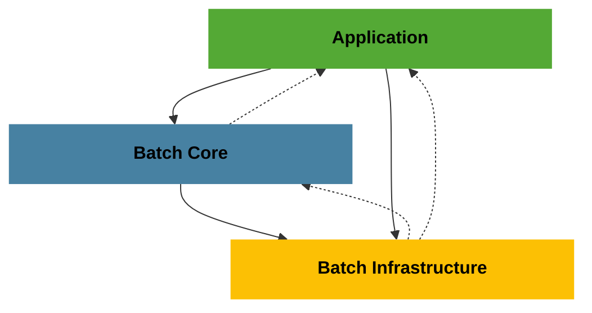

# Spring_Batch_6

## Architecture de Spring Batch 6

```mermaid
flowchart TD
    %% Définition des blocs avec une largeur fixe pour un alignement parfait des bords
    A["<div style='width: 250px; text-align: center;'>Application</div>"]
    B["<div style='width: 250px; text-align: center;'>Batch Core</div>"]
    C["<div style='width: 250px; text-align: center;'>Batch Infrastructure</div>"]

    %% Flèches centrales (Application <-> Batch Core <-> Batch Infrastructure)
    A --> B
    B -.-> A
    B --> C
    C -.-> B

    %% Flèches latérales (Application <-> Batch Infrastructure)
    %% L'utilisation de ---> allonge le lien pour qu'il contourne proprement le bloc central
    A ---> C
    C -.-> A

    %% Styles des couleurs
    style A fill:#54a935,color:black,stroke:none,font-weight:bold
    style B fill:#4781a2,color:black,stroke:none,font-weight:bold
    style C fill:#fcc004,color:black,stroke:none,font-weight:bold
```